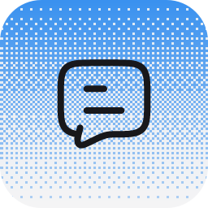

<p align="center">
  <picture>
    <source media="(prefers-color-scheme: dark)" srcset="./icon-dark.png" />
    
  </picture>
</p>

<div align="center">

# Feedback Board

</div>

A public feedback board and private Ryu product workspace: collect requests, votes, and comments, turn demand into a roadmap, and use configurable Ryu workflows to prepare or build what users ask for.

> **The public home of `ryu-feedback-board`.** Source, builds, and releases live here —
> binaries for every platform are attached to each release.
>
> This tree is generated from the Ryu monorepo, so commits pushed here
> directly are replaced on the next sync. **Pull requests are welcome** —
> open them here and they are ported into the monorepo, then flow back out.
> Ryu as a whole: https://github.com/amajorai/ryu

## Install

**App:** [Install](ryu://apps/@ryu/feedback-board) (opens the Ryu desktop app and asks you to confirm)

**CLI:**

```bash
ryu apps add @ryu/feedback-board
```

**Crate:**

```bash
cargo install ryu-feedback-board
```

Prebuilt binaries for every platform are attached to [each release](https://github.com/amajorai/ryu/releases).

## License

Apache-2.0 — see [LICENSE](./LICENSE).

## The loop

1. Share a public board at `/feedback/<board-slug>`.
2. Visitors submit requests, vote, and add context.
3. The Ryu companion triages, tags, deduplicates, and prioritizes requests.
4. A request can become a Space brief, a Blueprint-reviewed plan, or a
   configurable Ryu workflow run.
5. Planned and shipped status changes project back to the public roadmap and
   changelog.

## Package layout

- `manifest.json` is the runtime and permission contract.
- `backend/` is the standalone `ryu-feedback-board` sidecar and SQLite store.
- `ui/` contains the sandboxed admin companion and public portal source. The
  build emits one self-contained companion bundle and one public bundle; the
  public bundle is also carried by the sidecar source so the backend satellite
  can build without depending on Core.

## Ryu seams

The admin companion reaches its own sidecar through the generic `app:http`
bridge. It uses Ryu's existing `storage:kv`, Spaces, model, agent, workflow,
and Blueprint bridges. The sidecar has no dependency on `apps/core` and binds
to loopback; Core exposes its public API through the manifest's `public_mount`.

## Local checks

```sh
bun run --cwd apps-store/feedback-board/ui test
bun run --cwd apps-store/feedback-board/ui check-types
bun run --cwd apps-store/feedback-board/ui build
cargo test --manifest-path apps-store/feedback-board/backend/Cargo.toml
```

Build the companion before building the sidecar so the public bundle carriage
is refreshed:

```sh
bun run --cwd apps-store/feedback-board/ui build
cargo build --manifest-path apps-store/feedback-board/backend/Cargo.toml
```

## Current boundary

This release is node-local. It does not ship custom domains, hosted
multi-tenant provisioning, SSO, email delivery, or external integrations.
